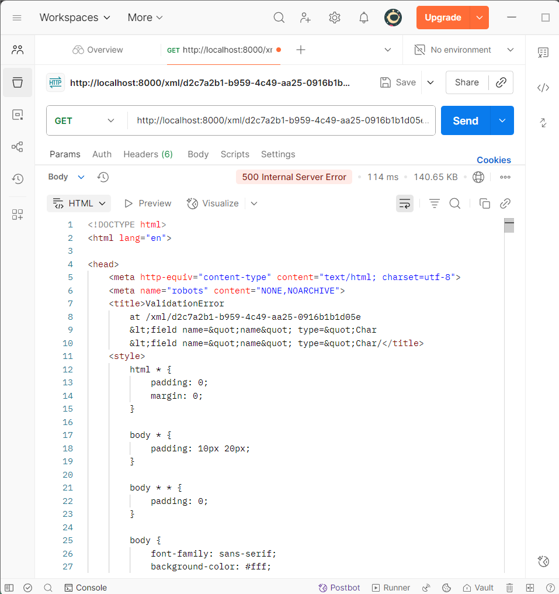
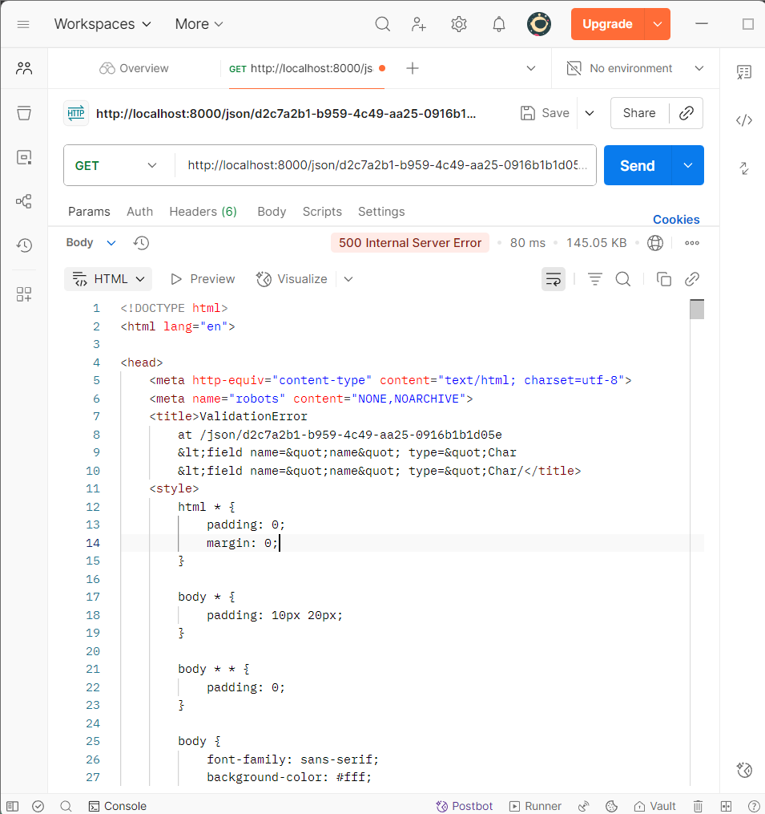

# NEWGAMES SHOP
[Tautan aplikasi NewGames Shop](https://ardyana-feby-newgameshop.pbp.cs.ui.ac.id/)

 Tugas 2 

 Tugas 3 

# TUGAS 3
**1. Jelaskan mengapa kita memerlukan data delivery dalam pengimplementasian sebuah platform?**

Karena dalam membuat platform tentunya pasti ada interaksi berupa data yang ditukar antara server dan pengguna. Dengan adanya data delivery baik user maupun server tidak bingung untuk membaca atau memproses interaksi yang ada antara user dan pengguna. Contoh, user sudah klik, jika tidak ada data delivery di platform, di server bisa jadi datanya tidak tersampaikan, apalagi server hanya bisa memproses data dari user dengan format yang jelas.

**2.  Menurutmu, mana yang lebih baik antara XML dan JSON? Mengapa JSON lebih populer dibandingkan XML?**

Menurut saya JSON lebih baik daripada XML karena data yang ditampilakn JSON lebih rapih dan terstruktur karena menampilkan pasangan key-value sehingga terlihat lebih simple dan mudah dibaca dengan mata. Selain itu JSON juga sudah kompetibel langsung dengan JavaScript. XML memnag bagus untuk dokumen yang teksnya banyak, tetapi formatnya panjang dan lebih berat untuk di-parse karena memiliki tag pembuka-penutup yang bersarang.

**3. Jelaskan fungsi dari method is_valid() pada form Django dan mengapa kita membutuhkan method tersebut?**

is_valid() di sini untuk buat ngecek apakah data yang diisi user udah benar atau belum sesuai aturan (misalnya field wajib, tipe angka, datatype valid). Jadi sebelum data masuk database, kita cek dulu dulu supaya tidak error.

**4. Mengapa kita membutuhkan csrf_token saat membuat form di Django? Apa yang dapat terjadi jika kita tidak menambahkan csrf_token pada form Django? Bagaimana hal tersebut dapat dimanfaatkan oleh penyerang?**

CSRF token untuk mencegah adanya Cross-Site Request Forgery, yaitu pihak ketiga "titip" permintaan POST/PUT/DELETE ke situs kita melalui sesi pengguna tanpa sepengetahuan mereka. Kalau tidak menggunakan CSRF token, orang jahat bisa bikin form palsu di luar sana tapi tetap mengirim request ke web kita pakai akun kita tanpa sadar. Sehingga bisa menimbulkan bahaya, seperti data kehapus atau akun ketakeover.

**5. Jelaskan bagaimana cara kamu mengimplementasikan checklist di atas secara step-by-step (bukan hanya sekadar mengikuti tutorial)**

Langkah pertama saya buat model, model ini sebagai representasi“bentuk data” yang ingin disimpan ke database. Model ini yang nanti akan almemastikan bahwa data yang tersimpan memiliki format dan atribut yang sesuai, seperti nama, harga, deskripsi, dll. Selanjutnya membuat form di direktori main. Dengan form ini, user bisa memasukkan data lewat halaman web. Nah, form ini juga sekalian ngecek validasi supaya data yang masuk benar (misalnya harga angka, bukan huruf). Selanjutnya di views.py saya menambahkan beberapa fungsi sebagai penghubung model, form, dan template. Di sini saya membuat fungsi untuk menampilkan daftar item, menambahkan data baru, menampilkan detail, dsb. Setelah views selesai, setiap fungsi perlu dihubungkan dengan alamat URL tertentu. Routing ini memastikan bahwa setiap permintaan pengguna diarahkan ke fungsi yang sesuai. Selanjutnya supaya lebih menarik dan informatis tampilannya di halaman html (main.html), saya menambahkan tombol "Add" dan "Details untuk melihat detail produk yang ingin diklik. Setelah itu saya akses local host dengan /xml/ dan /json/ untuk mengecek di POstman, apakah datanya sudah keluar dengan format benar atau belum.

### XML

### JSON

 Tugas 4 

# TUGAS 4
**1. Apa itu Django AuthenticationForm? Jelaskan juga kelebihan dan kekurangannya?**

Django AuthenticationForm adalah bawaan dari Django untuk melakukan login. Di sini username dan password user akan ditentukan kevalidannya melalui sistem autentikasi yang ada di Django. Kelebihannya mudah dipakai, aman karena ada password verifikasinya, dan otomatis untuk validasi dan menampilkan pesan error jika password salah atau kurang input (tidak perlu membuat logic untuk validasi). Kekurangannya adalah, fitur dalam authenticationform ini masih terbatas, tidak ada fitur "remember me" dan captcha.

**2. Apa perbedaan antara autentikasi dan otorisasi? Bagaimana Django mengimplementasikan kedua konsep tersebut?**

Sederhananya autentikasi adalah proses verifikasi siapa identitas kita, sedangkan otorisasi adalah proses verifikasi apa saja yang bisa atau boleh kita lakukan. Implementasi pada Django untuk autentikasi ada authenticate(), login(), logout(), sedangkan untuk otorisasi ada sistem permission/groups, decorator dengan @permission_required, is_superuser, @login_required, dan lainnya.

**3. Apa saja kelebihan dan kekurangan session dan cookies dalam konteks menyimpan state di aplikasi web?**

 Kelebihan session adalah lebih aman karena datanya tidak disimpan di browser milik user tetapi langsung ke server sehingga untuk menyimpan data yang sensitif cocok (bisa dihapus/diblokir langsung dari server). Kekurangannya karena tersimpan di server, perlu penyimpanan dan manajemen skala besar karena semakin banyak user semakin berat juga storagenya Kelebihan Cookie, lebih ringan karena datanya hanya disimpan di browser web user, sehingga tidak memberatkan server storage. Kekurangannya rawan untuk data penting karena user juga bisa melihat dan mengubah cookie (akan bahaya jika isi cookie merupakan password atau token). Oleh karena itu, data pentingdi cookie wajib dienkripsi supaya tidak bisa dimanipulasi.

**4. Apakah penggunaan cookies aman secara default dalam pengembangan web, atau apakah ada risiko potensial yang harus diwaspadai? Bagaimana Django menangani hal tersebut?**

Tidak aman 100%, karena cookie sebenarnya data yang dikirim bolak balik dari browser ke server, jika tidak dimanage secara benar, cookie dapat berpotensi untuk dicuri atau dimanipulasi. Django menggunakan CSRF middleware untuk mitigasi, jadi setiap ada POST/PUT/PATCH/DELETE maka dicek apakah ada token CSRF yang valid/cocok? jika tidak ada request akan ditolak. Hal ini akan mencegah serangan CSRF attack yang kemungkinan terjadi.

**5. Jelaskan bagaimana cara kamu mengimplementasikan checklist di atas secara step-by-step (bukan hanya sekadar mengikuti tutorial)**

Step lanjutan dari tugas sebelumnya, pertama-tama saya menambahkan path di urls.py dan method di views.py berupa login, logout, dan register. Saya mengimplementasikan AuthenticationForm di method login, logout, dan register yang diisikan di views.py. Tidak lupa saya kelompokkan otorisasi pengguna dengan menghubungkan user dan productnya dengan mmenambahkan di model Item, user = ForeignKey(User,...). Tidak lupa menambahkan @login_required di atas show_items dan show_main supaya hanya orang-orang yang login dan mempunyai akun saja yang bisa melihat isi dari main page. Kemudian untuk menampilkan detail informasi pengguna yang sedang logged in, saya menambahkan 'name' : request.user.username, supaya saat mengakses itu, Django mengecek session lalu mengambil data sesuai dengan user terkait. Untuk cookies saya menambahkan di show_main 'last_login': request.COOKIES.get('last_login', 'Never') di mana cookie ini akan menampilkan kapan terakhir kaii user login, data yang diambil pun bukan merupakan data yang sensitif. 

 Tugas 5 

# TUGAS 5
**1. Jika terdapat beberapa CSS selector untuk suatu elemen HTML, jelaskan urutan prioritas pengambilan CSS selector tersebut!**

1. Inline style adalah style atribut langsung yang ada di HTML biasanya ditandai dengan **style ="..."**. Inline setelctor ini merupakan prioritas paling atas.
2.  ID Selector ( **#id** ) seperti **#header** merupakan prioritas yang lebih tinggi dari class/attribute selector.
3.  Class Selector termasuk attribute selector dan pseudo class( **.class**, **[attr]** , **:hover** ) merupakan prioritas yang lebih tinggi dari elemen selector/tag biasa.
4.  Tag/Element selector (**div**, **p**, **h1**) merupakan prioritas yang paling rendah.
   
Biasanya juga bisa menggunakan **!important** untuk styling, di mana selalu diprioritaskan paling tinggi, melebihi Inline Style.

**2. Mengapa responsive design menjadi konsep yang penting dalam pengembangan aplikasi web? Berikan contoh aplikasi yang sudah dan belum menerapkan responsive design, serta jelaskan mengapa!**

Sebenarnya hal ini berkaitan dengan user experience pengguna saat menjelajahi website kita. Kita tidak bisa mengatur pengguna untuk membuka website kita di device yang spesifik, contohnya hanya bisa dibuka di browser Safari. Kita sebagai developer, baiknya memperkirakan desain yang sekiranya memberikan kenyamanan pada user. Contohnya, banyak jenis perangkat untuk mengakses website di dunia ini, desain website kita harus bisa menerapkan *responsive design* dan beradaptasi dengan perangkat-perangkat terkait. Jika seandainya tidak ada *responsive design* maka tampilan bisa pecah, teks terlalu kecil, dan tombol tidak bisa diklik sehingga tidak memberikan kenyamanan pada pengguna. Hal ini bisa menyebabkan user enggan untuk memberikan *value* pada website kita.

**3.  Jelaskan perbedaan antara margin, border, dan padding, serta cara untuk mengimplementasikan ketiga hal tersebut!**

Margin terletak di luar border elemen, fungsi dari margin ini adalah untuk memberikan jarak antar elemen. Sedangkan, border terletak di garis tepi elemen, fungsi dari border ini adalah untuk membatasi area ekenen, bisa juga memberikan ketebalan, warna, style seperti solid, dashed, dll. Sedangkan, padding terletak pada border elemen (di antara content & border). Fungsi dari padding adalah untuk memberikan ruang antara isi elemen, seperti teks atau gambar, dengan bagian border (tepi).

**Contoh penggunaan :**

Saya ambil dari global.css

<pre>.form-style input[type="checkbox"]
{
    width: 1.25rem;           //lebar checkbox
    height: 1.25rem;          // tinggi checkbox
    padding: 0;               // tidak ada ruang di dalam kotak
    border: 2px solid #d1d5db; // garis tepi checkbox warna abu-abu Tailwind (gray-300)
}

</pre>

**4. Jelaskan konsep flex box dan grid layout beserta kegunaannya!**
Flexbox adalah sistem tata letak CSS yang dirancang untuk memudahkan elemen dalam satu dimensi (horizontal atau vertikal). Flexbox biasanyab digunakan untuk menyusun item secara horizontal dan vertikal, mengatur jarak antaritem, mengatur item ke tengah baik secara horizontal ataupun vertikal, melebarkan atau mengecilkan item sesuai ruang yang tersedia. Biasanya flexbox dipakai untuk navigasi bar. Sedangakn Grid Layout adalah sistem tata letak CSS untuk dua dimensi (baris dan kolom). Penggunaan grid layout didefinisikan sebagai grid track (kolom dan baris). Biasanya digunakan untuk galeri produk dan dashboard.

**5. Jelaskan bagaimana cara kamu mengimplementasikan checklist di atas secara step-by-step (bukan hanya sekadar mengikuti tutorial)!**

Pertama-tama saya menggunakan framework Tailwind untuk styling CSSnya.Lalu saya pakai Tailwind di base template supaya page form/login/register/nav/card memiliki tampilan yang sama. Di html login dan register saya memakai class Tailwind untuk padding, border, color, dan hover. Begitu pula di html lain seperti main, items_detail, create_items, card_items. Saya juga membuat file global css untuk kostumisasi style. Untuk di bagian navigasi karena agak berbeda dengan tutorial, saya menambahkan tag baru yaitu <pre> < a > </ a >
</pre> 
untuk menambahkan kategori-kategri yang bisa diakses langsung dari navbar. Saya melakukan ini tidak hanya di desktop user, tetapi juga di bagian mobile user. 

